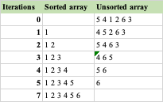

Selection Sort

- In case of selection sort we repeatedly find the minimum element and move it to the sorted part of array to make unsorted part sorted.

DRY RUN:

Main advantage of Selection Sort:
 - it performs well on a small array list, it does not require an additional space

Main disadvantage of Selection Sort:
 - Average time complexity is poor, and only suitable for small unsorted lists

When to use selection sort?
- when we have insufficient memory
- Easy to implement

When to avoid selection sort?
- when time is a concern

Implementation in java:

    public void selectionSort(int[] arr) {
        for (int j = 0; j < arr.length; j++) {
            int minimumIndex = j;
            for (int i = j + 1; i < arr.length; i++) {
                if (arr[i] < arr[minimumIndex]) {
                    minimumIndex = i;
                }
            }
            if (minimumIndex != j) {
                int temp = arr[j];
                arr[j] = arr[minimumIndex];
                arr[minimumIndex] = temp;
            }
        }
    }

Big O complexity:
Time complexity - O(N^2), Space complexity - O(1)

