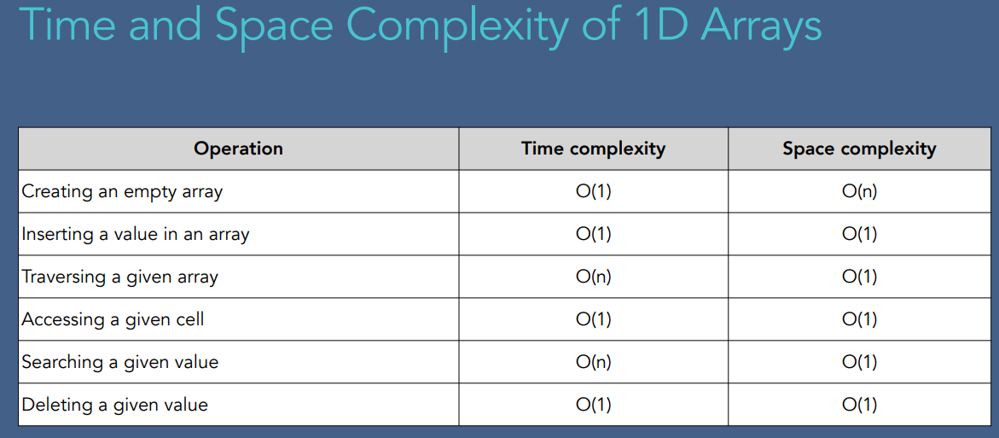
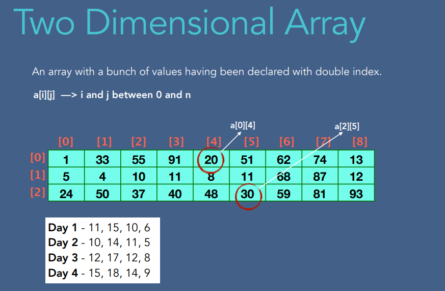
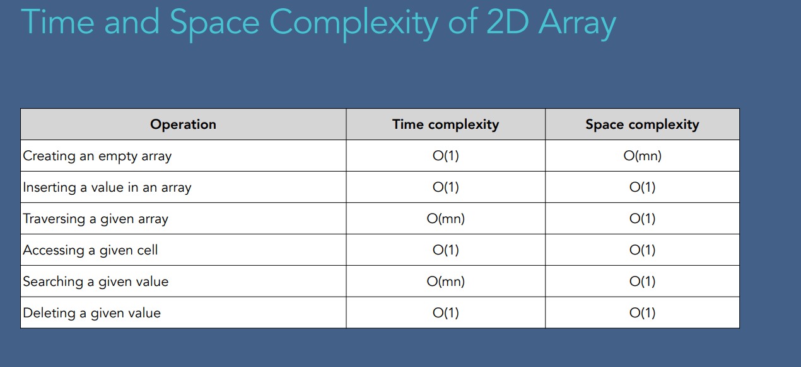
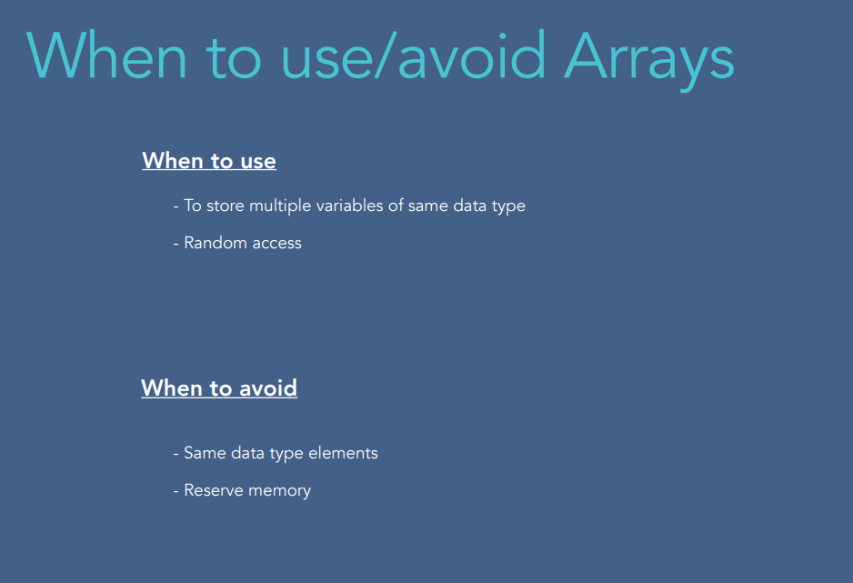

What is an Array?

- Array can store data of specified type;
- Elements of an array has a unique index;
- Fixed size;

Types of ArrayExample?

1. One dimensional Array - a[i] -> i between 0 and n
2. Two-dimensional Array -a[i][j] -> i and j between 0 and n
3. Three-dimensional Array - a[i][j][k] -> a[0][0][1]

Creating an Array
When we create an array, we:
- Declare - creates a reference to array
- Instantiation of an array - creates an array
- Initialization - assigns values to cells in array

dataType[] arr;
arr = new dataType[];
arr[1]=1;
arr[0]=2;

Integer.MIN_VALUE = 2pow31

Two Dimensional Array

Time and Space Complexity for 2D Array:

